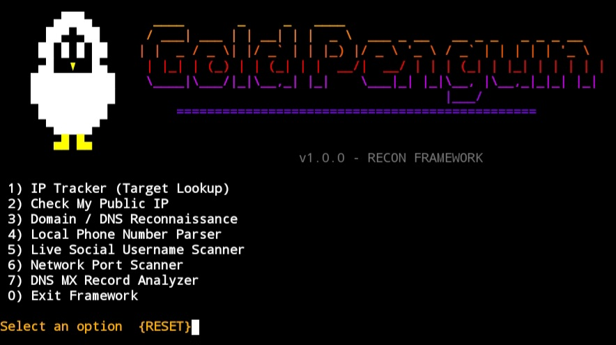

# gold_penguin tool

# gold_penguin
Gold penguin tool is a new tool for developers. This tool is create for didattics targets.
# where can I use it?
this is a termux tool
# installation
```pkg upgrade && pkg update```
```pkg install python -y```
```pip install phonenumbers```
```git clone https://github.com/moretti-777/gold_penguin-.git```
```cd gold_penguin```
```python gold_penguin.py```
